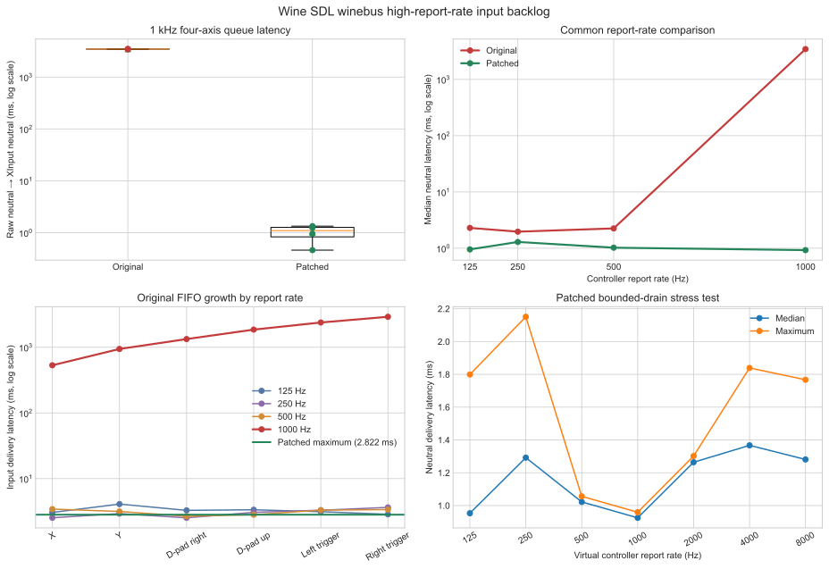

# Wine SDL winebus high-rate input reproducer

A deterministic Linux uinput → SDL winebus → Windows XInput harness for a
Wine/Proton bug that queues stale controller states under high report rates.



## Result

With four changing axes at 1 kHz, the original backend delivered neutral to
XInput a median **3457.161 ms** late. Coalescing pending absolute-axis states
reduced the median to **1.099 ms**. The final two-controller regression run
delivered every ordered input edge within **2.822 ms**.

The original implementation also delayed short discrete inputs progressively
as its FIFO grew: X at 531 ms, Y at 941 ms, D-pad right at 1332 ms, D-pad up at
1856 ms, left trigger at 2381 ms, and right trigger at 2908 ms.

## Root cause

The SDL backend processes one SDL event into one complete HID report, then
returns one queued report per wait call. A controller can generate several SDL
axis events per physical report. At 1 kHz, production exceeds consumption and
Wine replays increasingly old controller states.

The proposed fix drains a bounded batch of pending SDL events and coalesces
only consecutive absolute-axis reports for the same device. Buttons, hats,
relative motion, device lifecycle events, and force-feedback reports remain
ordering barriers.

## Reproduce

Requirements include Linux uinput, SDL2, a C compiler, MinGW-w64, Python 3,
and a Proton build whose SDL winebus backend is selected.

```sh
sudo modprobe uinput
sudo chmod 666 /dev/uinput
make
./run_test.sh baseline
./run_test.sh patched
./run_regression.sh patched
```

The local runner currently points to
`~/.local/share/Steam/compatibilitytools.d/Proton-CachyOS-InputFix`; adjust
`root` in the runner scripts for another build. `PROTON_PREFER_SDL=1` is set by
the scripts. Each run uses a fresh prefix and restores the patched binary on
exit.

Generate the charts with:

```sh
python3 plot_results.py
```

## Test coverage

The regression suite drives two simultaneous virtual Xbox controllers while
both generate changing axes at 1 kHz. It checks:

- ordered button press/release edges;
- D-pad transitions;
- analog triggers;
- distinct XInput slots and device isolation;
- hot-unplug and reconnect;
- XInput rumble delivery to both Linux force-feedback devices.

See [UPSTREAM_EVIDENCE.md](UPSTREAM_EVIDENCE.md) for methodology, environment,
measurements, and safety properties. Selected raw captures and analyzer output
are retained under [`results/`](results/).

The corresponding WineHQ patch is retained under [`patches/`](patches/) for
review and exact reproduction.

## Origin

The issue was first reproduced with a GameSir Nova 2 Lite (`3537:1098`) using
its 2.4 GHz receiver in Xbox mode. Linux evdev remained current while Proton
games continued moving for three to four seconds after both sticks stopped.

## License

The harness is available under the [MIT License](LICENSE).
